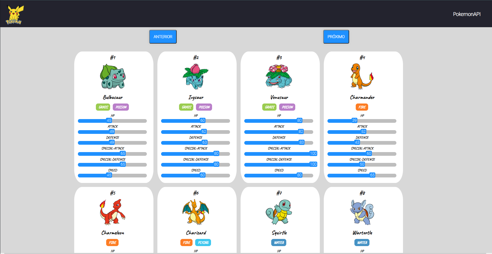

# Pokemon API

Esse projeto foi feito para fixar conhecimento no front-end,
o back-end foi utilizada a PokeApi. Basicamente, eu faço o consumo
de endpoints da API e mostro alguns dados disponíveis dos pokemons.


## Stack utilizada

**Front-end:** React, HTML, CSS, JS


## Demonstração

Caso queira ver como está o projeto, basta clicar [aqui](https://vini192.github.io/pokemon/)




## Instalação

Para instalar o projeto, você primeiro deve clonar o repositório e rodar os comandos:
```bash
    cd pokemon
    npm install 
```

Para rodar localmente, após utilizar dos comandos acima, use: 
```bash
    npm start
```

    
## Deploy

Para fazer o deploy deste projeto no GH-Pages, é necessário alterar o homepage no package.json e logo após rodar o seguinte comando:

```bash
  npm run deploy
```


## Autores

- [Vinicius F. do Nascimento](https://github.com/vini192)


## Referência

 - [PokeAPI](https://pokeapi.co)